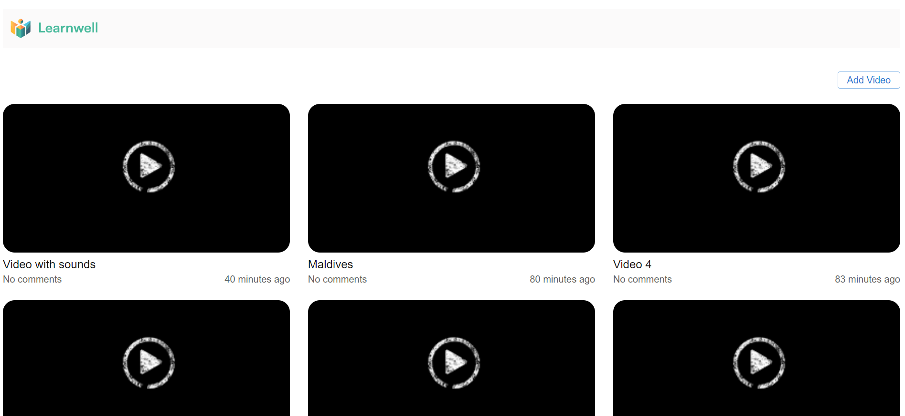
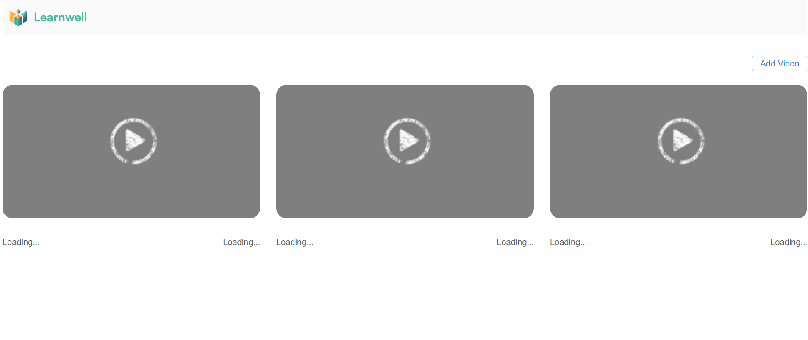
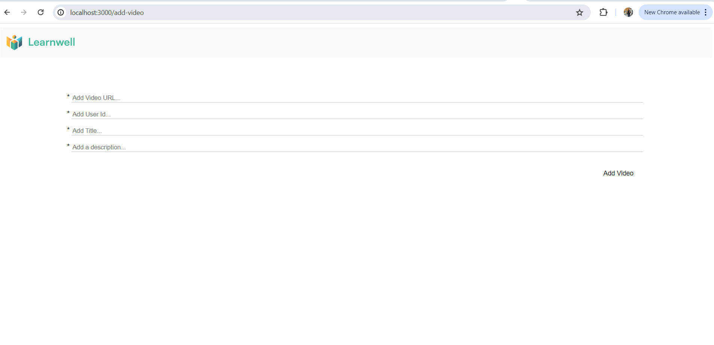
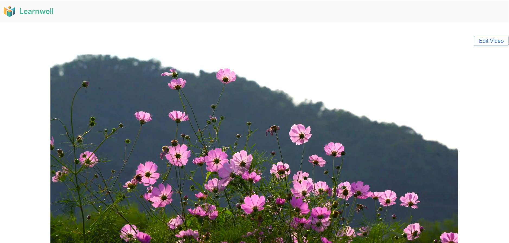
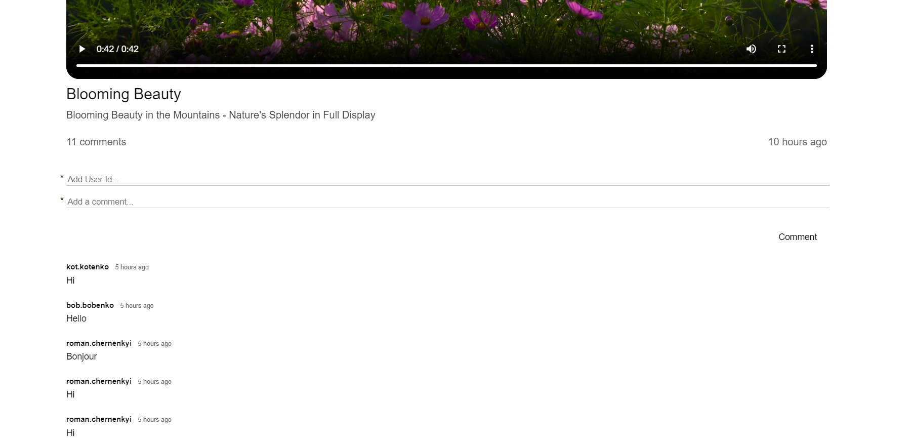
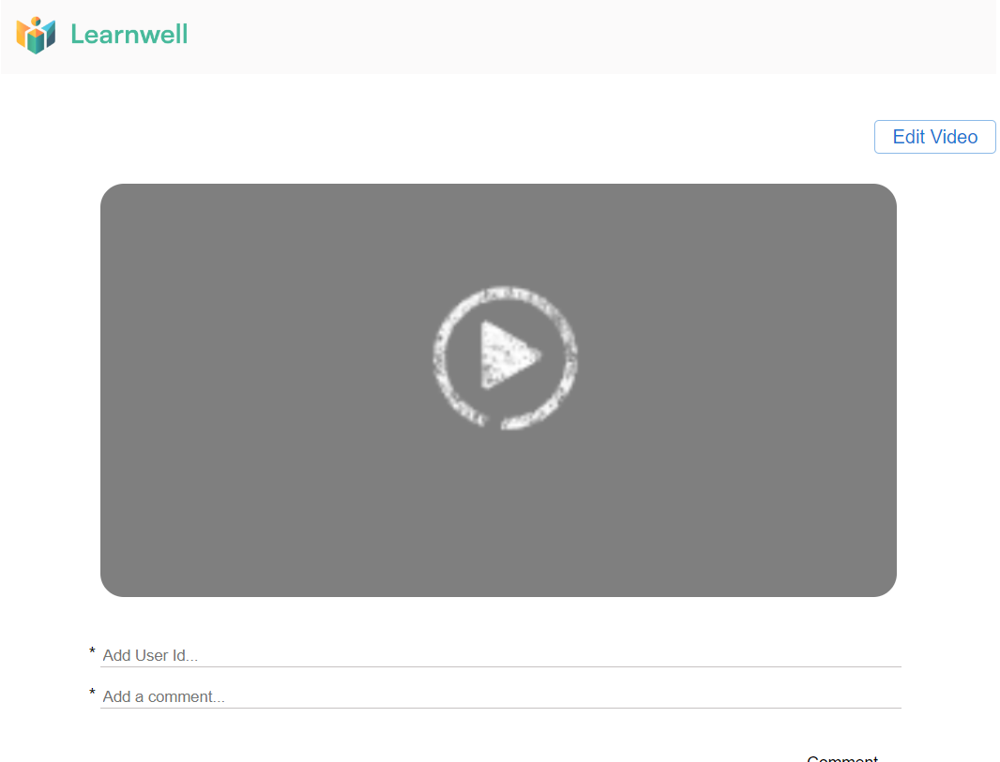
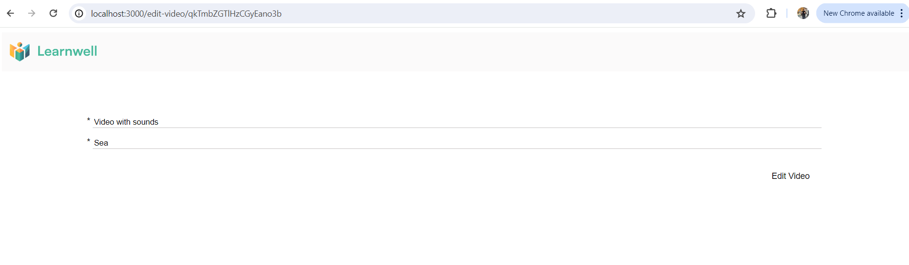

    

    <h1 align="center">Educational Video Player</h3>

    
<b>Technologies Used</b>

    <ul>
        <li>ReactJS</li>
        <li>TypeScript</li>
        <li>React Router</li>
        <li>axios</li>
    </ul>

    <h2 align="center">Main page (path: "/")</h2>

    

<b>Header</b>: The header of the page includes a logo. Clicking on the logo redirects users back to the main page, ensuring easy navigation to the home screen.

<b>Add Video Button</b>: A button labeled "Add Video" that redirects users to a page where they can add new videos. This feature simplifies the process of expanding the video library.

<b>Video List</b>: Main page show a list of videos and allow users to select a video from the list.

Each video entry in the list shows the following details:

    <ul>
        <li>Video Title</li>
        <li>Number of Comments</li>
        <li>Upload Time</li>
    </ul>

    

<b>Fallback Component</b>: A fallback component is displayed while the main page is loading. This component enhances the user experience by providing a visual indicator that the content is being loaded, ensuring users are aware that the application is working on retrieving the data.

    <h2 align="center">Add Video page (path: "/add-video")</h2>

The page has 4 required fields:

    <ul>
        <li>Video URL</li>
        <li>User ID</li>
        <li>Title</li>
        <li>Description</li>
    </ul>

<b>Add Video</b> button: Clicking this button submits the entered information to add the video to the application. Upon clicking the "Add Video" button, users are redirected back to the Main Page of the application.

    

    <h2 align="center">Video Detailes page (path: "/video-details/:id")</h2>

The data for this page is preloaded. The page includes:

    <ul>
        <li>Edit Video button</li>
        <li>Video player</li>
        <li>Edit Video button</li>
        <li>Video title</li>
        <li>Video description</li>
        <li>Amount of comments</li>
        <li>When video was published</li>
        <li>Form for adding a comment to the video with 2 required fields: User Id and Comments. And a Comment button, which changes its color on hover</li>
        <li>List of comments with information about who left the comment, how long ago it was left, and the comment content</li>
    </ul>

    

    

    

<b>Fallback Component</b>: A fallback component is displayed while the main page is loading. This component enhances the user experience by providing a visual indicator that the content is being loaded, ensuring users are aware that the application is working on retrieving the data.

    <h2 align="center">Edit Video page (path: "/edit-video/:id")</h2>

The data for this page are preloaded. The page has 2 required fields:

    <ul>
        <li>Title</li>
        <li>Description</li>
    </ul>

<b>Edit Video</b> button: Clicking this button submits the entered information to add the video to the application. Upon clicking the "Edit Video" button, users are redirected back to the Main Page of the application.

    

